 

 

  <h3 align="center">GameHub</h3>

  

    An awesome Game for healing mind!
     
    <a href="https://github.com/Akshay01-M/GameHub/tree/main/project%20report"><strong>Explore the project files »</strong></a>
     
     
    View Demo
    ·
    Report Bug
    ·
    Request Feature
  

This is on multi game system using `c++`
--
> Project on c++ used in college 1st year of <a href="https://www.cuchd.in/">CHANDIGARH UNIVERSITY</a> 

> Multi logics and creations 

> Purpose to implement the concept of `DSA` 
---
### Used Language 

> Screenshorts 

### Home screen
------------------------------------------------
Abvilable games | clicked count | Highest score
-----------------------------------------------

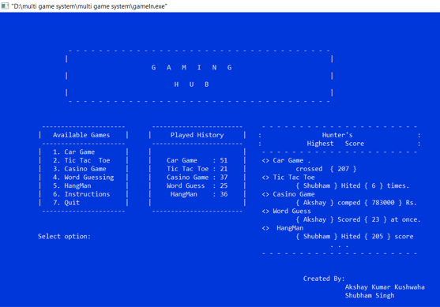

### Car Game
-------------------------------
|    Loading Page
------------------------------

-------------------------------
Running Game  |  Score And Highest Score
-------------------------------

---
### Player selection for Tic Tic Toe
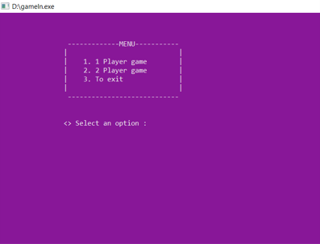

### Name creation
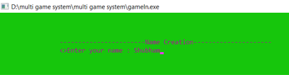
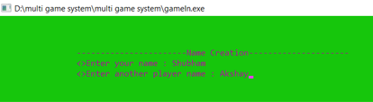

### Moment while playing
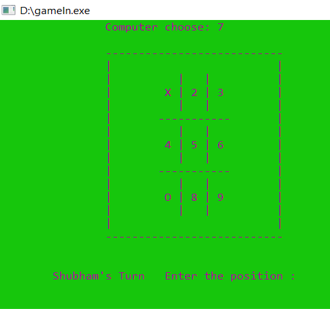
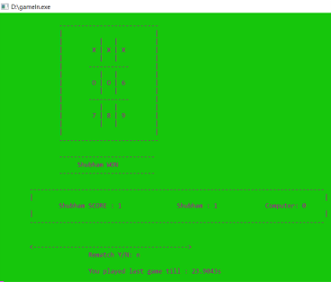

### Castino game
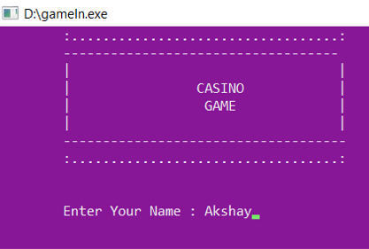
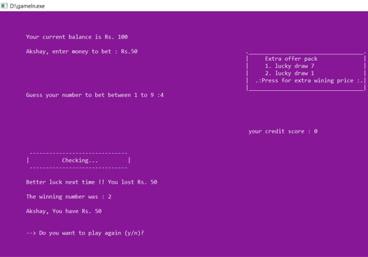

### Word Guessing game
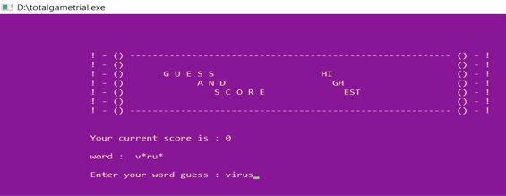
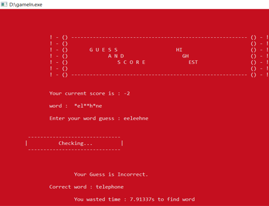
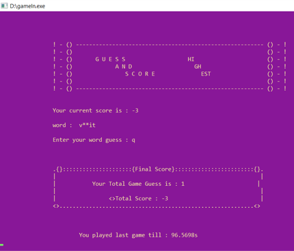

## HangMan game
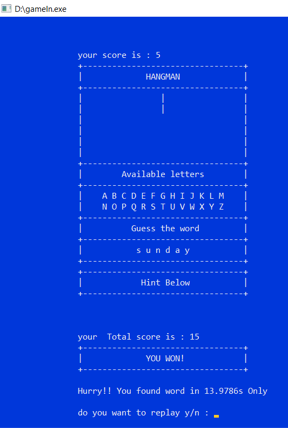

## Updated Scores
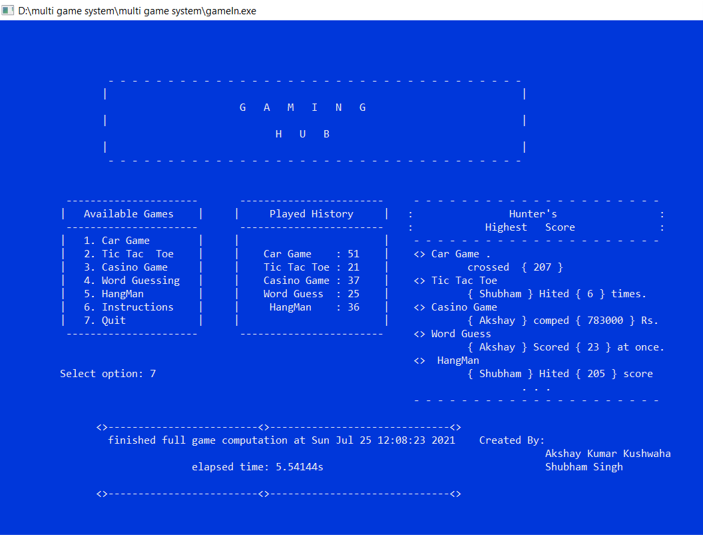

---

#### _Help me to make this more perfect!_
